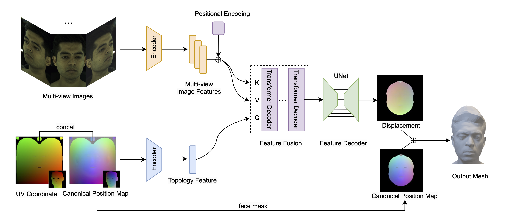

## FaceGeo
👶 This project builds a model to reconstruct an indivisual's face geometry given 6 portrait images captured from diffirent views.
- Input: 6 multi-view images of the face. 

    💁 If you have less than 6 images, the model can also work, but the accuracy can be low.

    💁 The input images should include {front, left, right, up, bottom} views of the face for the best accuracy. You neither need to provide their camera poses nor always use fixed camera poses.
- Output: A face mesh saved as an OBJ file.


🚀 The network has an encoder-fuser-decoder architecture.
- Encoder: Resnet18
- Fuser: Transformer decoder
- Decoder: UNet

🔔 We only release the code for inference. Colab Tutorial: click [here](https://colab.research.google.com/github/yankuai/FaceGeo/blob/main/FaceGeo-reconstruct-face-geometry-with-cross-attention.ipynb).

### Environment
```sh
git clone https://github.com/yankuai/FaceGeo.git
cd FaceGeo
pip install -r requirements.txt
```
### Inference
Inference on a folder of multiple indivisuals' face images.

- The data should be arranged into the following structure.

```sh
input/
├── subject_1
│   ├── view_1.png
│   ├── ...
│   └── view_k.png
├── ...
└── subject_n
      ├── view_1.png
      ├── ...
      └── view_k.png
```

- Download the pre-trained [weights](https://github.com/yankuai/FaceGeo/releases/download/v1.0.0/model.pt) into base folder and rename it as `model.pt`.

- Then modify the `home_dir`, `out_dir`, `data_dir`, and `checkpoint` in the config file `conf/inference.yaml`.

- Run the command:

```sh
python inference.py conf/inference.yaml
```
